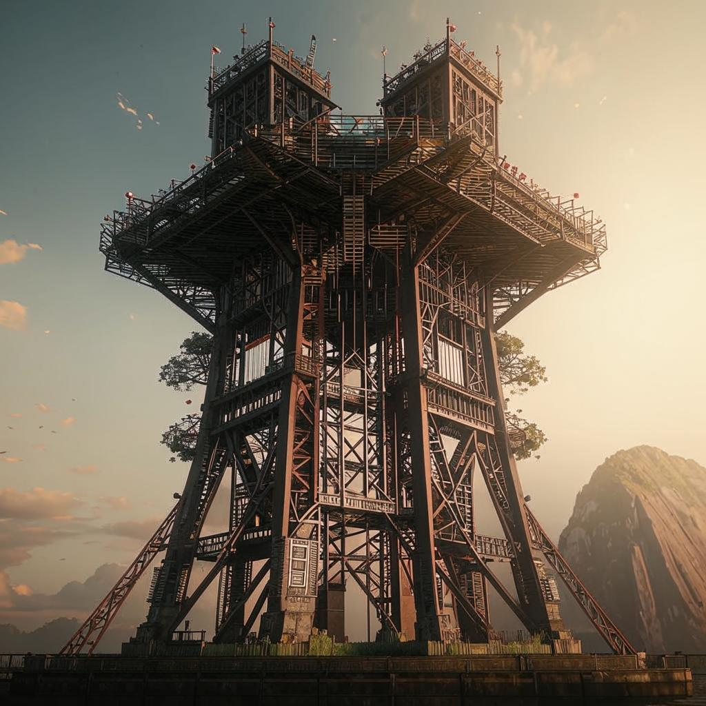
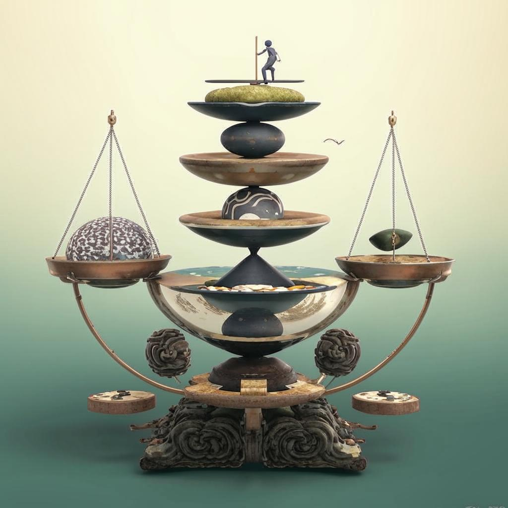
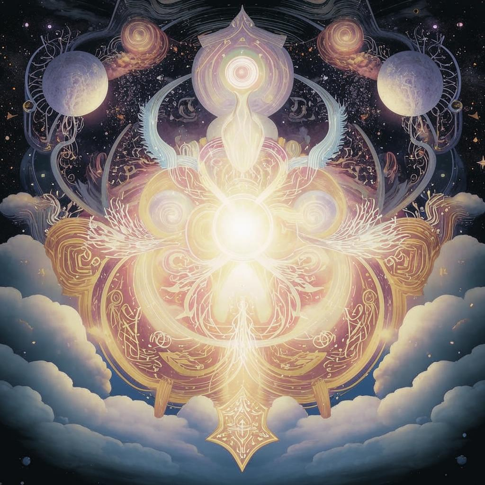
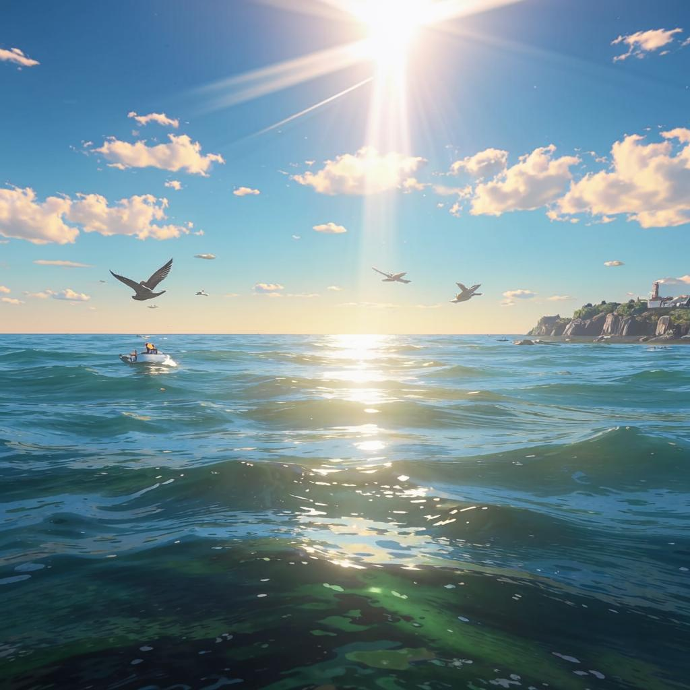
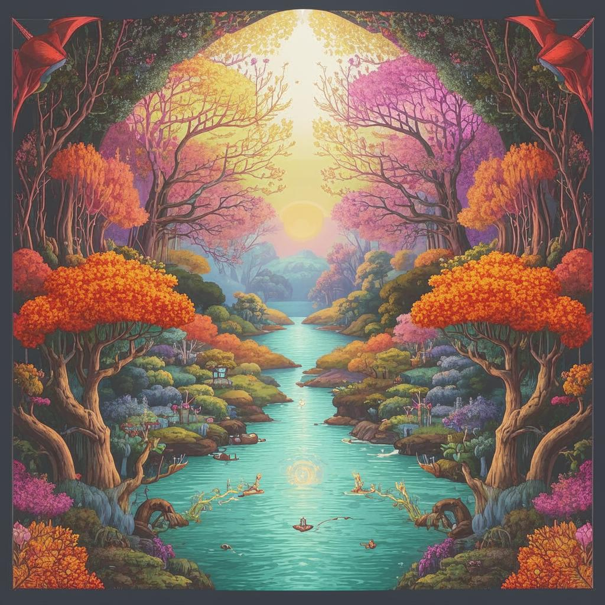
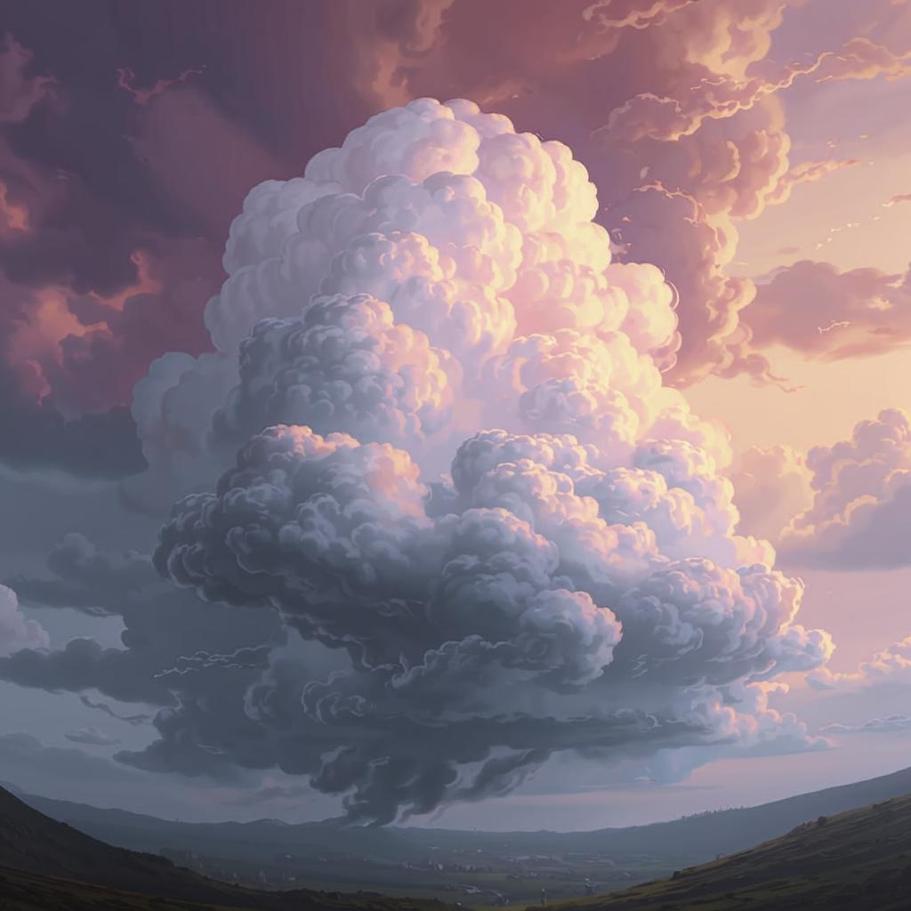
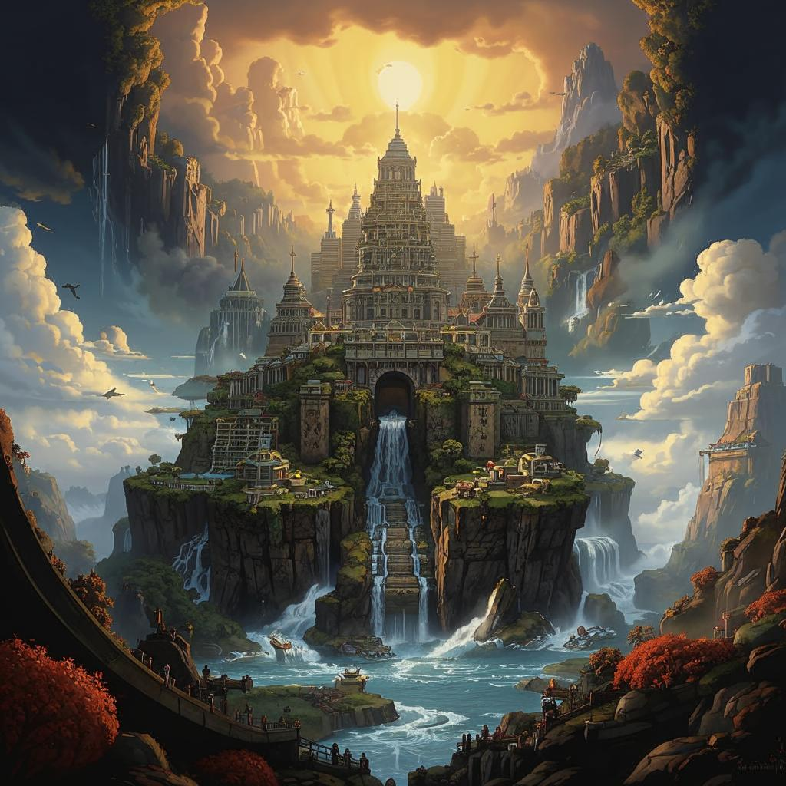
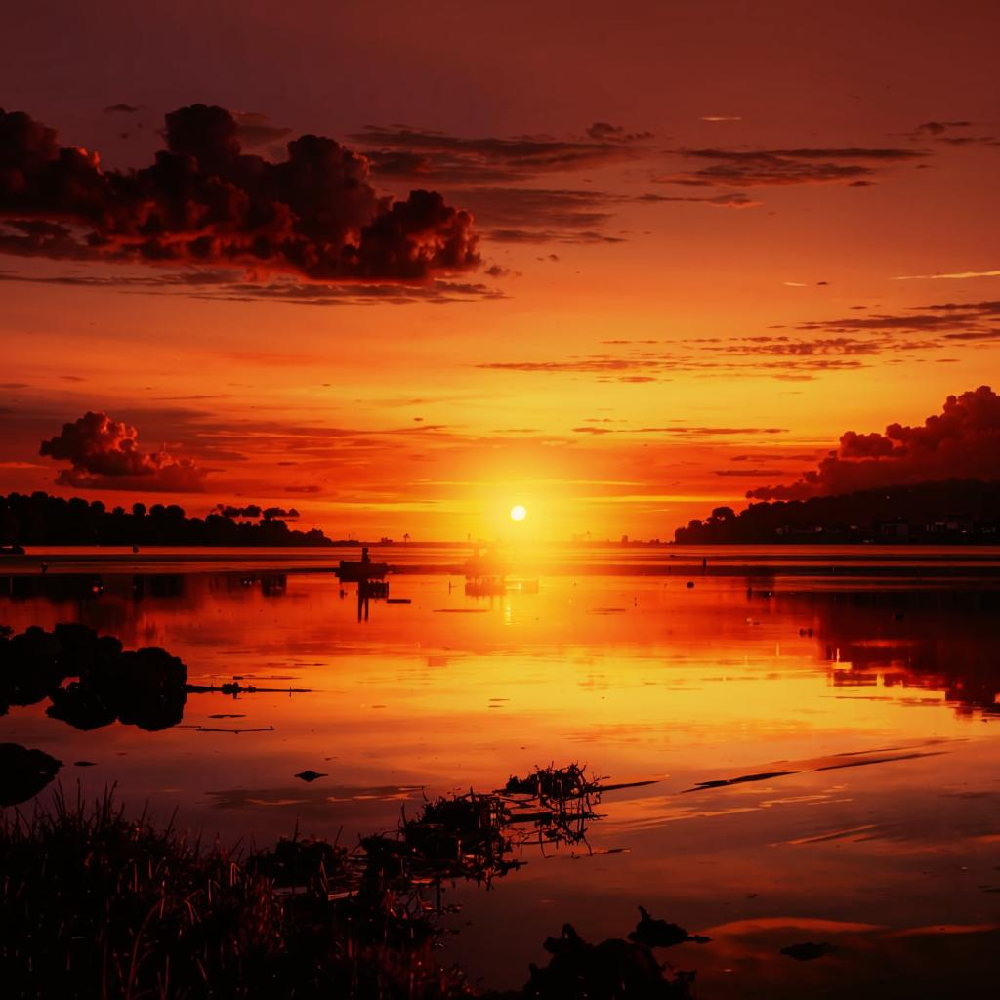

# Changelog

## 1.5.1 Железная независимость (2025-05-04)

https://github.com/tmible/wishlist/compare/a6015f0..master

## 1.5.0 Изменчивая уравновешенность (2025-05-02)

https://github.com/tmible/wishlist/compare/a868d06..a6015f0

## 1.4.0 Звездное небо (2025-05-01)

https://github.com/tmible/wishlist/compare/c6d1d7b..a868d06

## 1.3.2 Энергичный перфекционист (2025-04-21)

https://github.com/tmible/wishlist/compare/73142d0..c6d1d7b

## 1.3.1 Небесная гармония (2025-04-21)

https://github.com/tmible/wishlist/compare/c847256..73142d0

## 1.3.0 Могучие каменные башни (2025-04-21)

https://github.com/tmible/wishlist/compare/2197c5e..c847256

## 1.2.11 Сверкающий океан (2025-04-19)

https://github.com/tmible/wishlist/compare/201e4f0..2197c5e

## 1.2.10 Изменчивая грация. (2025-04-19)

https://github.com/tmible/wishlist/compare/654b07c..201e4f0

## 1.2.9 Могучее облако (2025-04-18)

https://github.com/tmible/wishlist/compare/7fdd3bc..654b07c

## 1.2.8 Зимняя стужа (2025-03-25)

https://github.com/tmible/wishlist/compare/701cfb0..7fdd3bc

## 1.2.7 Величественный 1742206901 (2025-03-17)

https://github.com/tmible/wishlist/compare/164adfd..701cfb0

## 1.2.6 Величественный закат. (2025-03-17)

https://github.com/tmible/wishlist/compare/2a4adce..164adfd

## 1.2.5 Вдохновляющая перспектива (2025-02-08)

https://github.com/tmible/wishlist/compare/fd30564..2a4adce

## 1.2.4 Величественный ландыш. (2025-02-07)

https://github.com/tmible/wishlist/compare/e6986b1..fd30564

## 1.2.2 Грозный ураган (2025-02-03)

https://github.com/tmible/wishlist/compare/e876c3c..e6986b1

## 1.2.1 Могучее величество (2025-02-03)

https://github.com/tmible/wishlist/compare/746fa01..e876c3c

## 1.2.0 Розовый куст (2025-02-03)

https://github.com/tmible/wishlist/compare/accd4c3..746fa01

## 1.1.4 Серебряный рассвет (2024-11-14)

https://github.com/tmible/wishlist/compare/00864bd..accd4c3

## 1.1.3 Великий Коба (2024-11-14)

https://github.com/tmible/wishlist/compare/3143d76..00864bd

## 1.1.2 Снежный Ком (2024-11-11)

https://github.com/tmible/wishlist/compare/3b943cd..3143d76
